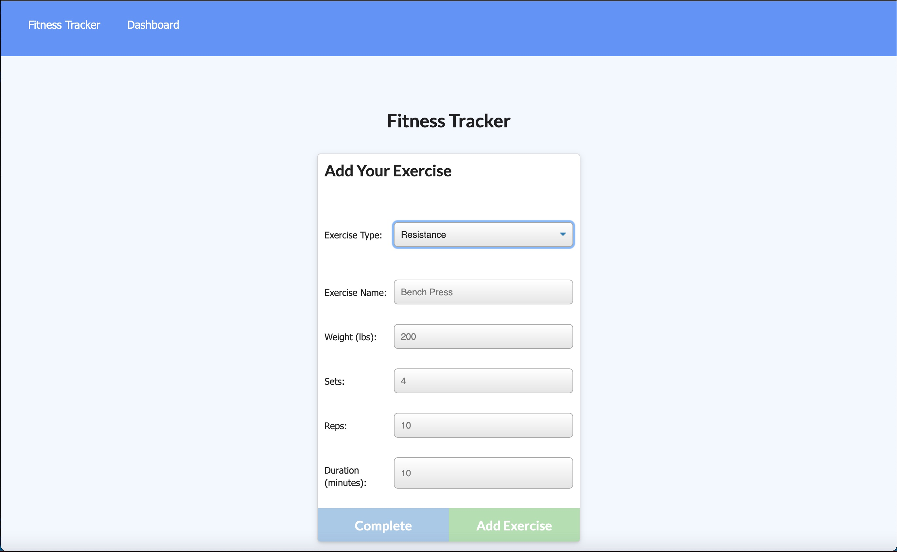

# mjl-FitnessTracker

## Table of Contents:
* [Deployed App](#deployed-app)
* [Description](#description) 
* [Acceptance Criteria](#acceptance-criteria) 
* [Screeshot](#screenshot) 

## Deployed App

This app is deployed on Heroku: https://fast-cove-67446.herokuapp.com/

## Description

This assignement was to create a workout tracker. The front end code was supplied for the assignment, so my task was to create a MongoDB database with a Mongoose schema and to add Express routes. Here is the user story (which was provided for the assignment):

```
As a user, I want to be able to view, create, and track daily workouts. I want to be able to log multiple exercises in a workout on a given day. I should also be able to track the name, type, weight, sets, reps, and duration of exercise. If the exercise is a cardio exercise, I should be able to track my distance traveled.
```

And here is the provided "business context":

```
A consumer will reach their fitness goals more quickly when they track their workout progress.
```

## Acceptance Criteria

And here is the acceptance criteria:

When the user loads the page, they should be given the option to create a new workout or continue with their last workout. The user should be able to:

  * Add exercises to the most recent workout plan.

  * Add new exercises to a new workout plan.

  * View the combined weight of multiple exercises from the past seven workouts on the `stats` page.

  * View the total duration of each workout from the past seven workouts on the `stats` page.


## Screenshot
